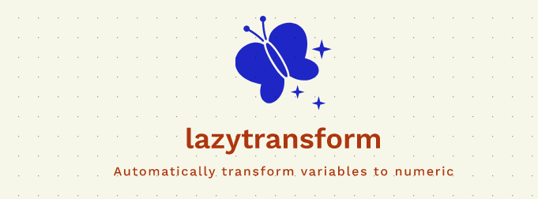
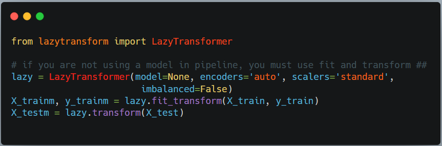
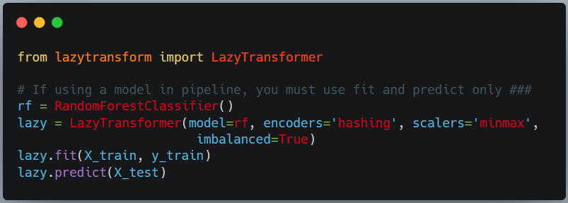

# lazytransform
Automatically transform all categorical, date-time, NLP variables in your data set to numeric in a single line of code for any data set any size.



# Table of Contents
<ul>
<li><a href="#What is lazytransform">What is lazytransform</a></li>
<li><a href="#How to use lazytransform">How to use lazytransform</a></li>
<li><a href="#How to install">How to install lazytransform</a></li>
<li><a href="#Usage">Usage</a></li>
<li><a href="#api">API</a></li>
<li><a href="#maintainers">Maintainers</a></li>
<li><a href="#contributing">Contributing</a></li>
<li><a href="#license">License</a></li>
</ul>
<p>

## What is lazytransform?
`lazytransform` is a new python library for automatically transforming your entire dataset to numeric format using category encoders, NLP text vectorizers and pandas date time processing functions. All in a single line of code!

`lazytransform` can be used in one or two ways. Both are explained below.
<p>
## How to use lazytransform
<br>

### 1.  Using lazytransform as a simple pandas data transformation pipeline 

<p>The first method is probably the most popular way to use lazytransform. The transformer within lazytransform can be used to transform and create new features from categorical, date-time and NLP (text) features in your dataset. This transformer pipeline is fully scikit-learn Pipeline compatible and can be used to build even more complex pipelines by you based on `make_pipeline` statement from `sklearn.pipeline` library. Let us see an example:<p>



### 2.  Using lazytransform as a sklearn pipeline with sklearn models or XGBoost or LightGBM models

<p>The second method is a great way to create an entire data transform and model training pipeline. `lazytransform` allows you to send in a model object (only the following are supported) and it will automatically transform, create new features and train a model using sklearn pipelines. This method can be seen as follows:<br>
<p>

<p>
The following models are currently supported:
<ol>
<li>All sklearn models</li>
<li>All MultiOutput models from sklearn.multioutput library</li>
<li>XGboost models</li>
<li>LightGBM models</li>
</ol>
However, you must install and import those models on your own and define them as model variables before passing those variables to lazytransform.

## How to install lazytransform
<p>
**Prerequsites:**
<ol>
<li><b>lazytransform is built using pandas, numpy, scikit-learn, category_encoders and imb-learn libraries.</b> It should run on most Python 3 Anaconda installations without additional installs. You won't have to import any special libraries other than "imb-learn" and "category_encoders".</li>
</ol>
[Anaconda](https://docs.anaconda.com/anaconda/install/)
<p>
To install from PyPi:

```
pip install lazytransform 
```
or
```
pip install git+https://github.com/AutoViML/lazytransform.git
```

To install from source:

```
cd <lazytransform_Destination>
git clone git@github.com:AutoViML/lazytransform.git
```
# or download and unzip https://github.com/AutoViML/lazytransform/archive/master.zip
```
conda create -n <your_env_name> python=3.7 anaconda
conda activate <your_env_name> # ON WINDOWS: `source activate <your_env_name>`
cd lazytransform
pip install -r requirements.txt
```
## Usage
<p>
You can invoke lazytransform as a scikit-learn compatible fit and transform or a fit and predict pipeline. See syntax below.
```
lazy = LazyTransformer(model=False, encoders='auto', scalers=None, 
        date_to_string=False, transform_target=False, imbalanced=False)
```

### if you are not using a model in pipeline, you must use fit and transform
```
X_trainm, y_trainm = lazy.fit_transform(X_train, y_train)
X_testm = lazy.transform(X_test)
```
### If using a model in pipeline, use must use fit and predict only
```
lazy = LazyTransformer(model=RandomForestClassifier(), encoders='auto', scalers=None, 
        date_to_string=False, transform_target=False, imbalanced=False)
```

```
lazy.fit(X_train, y_train)
lazy.predict(X_test)
```

## API

<p>
lazytransform has a very simple API with the following inputs. You need to create a sklearn-compatible transformer pipeline object by importing LazyTransformer from lazytransform library. <p>
Once you import it, you can define the object by giving several options such as:

**Arguments**

- `model`: could be any scikit-learn model (including multioutput models) as well as the popular XGBoost and LightGBM libraries.
- `encoders`: could be one more encoders in a string or a list. Each encoder string can be any one of the 10+ encoders from `category_encoders` library below.  Available encoders are listed here as strings so that you can input them in lazytransform:
  - `auto` - It uses `onehot` encoding for low-cardinality variables and `label` encoding for high cardinality variables.
  - `onehot` - One Hot encoding - it will be used for all categorical features irrespective of cardinality
  - `label` - Label Encoding - it will be used for all categorical features irrespective of cardinality
  - `hashing` or `hash` - Hashing (or Hash) Encoding
  - `helmert` - Helmert Encoding
  - `bdc` - BDC Encoding
  - `sum` - Sum Encoding
  - `loo` - Leave one out Encoding
  - `base` - Base encoding
  - `woe` - Weight of Evidence Encoding
  - `james` - James Encoding
  - `target` - Target Encoding
  - `count` - Count Encoding
  - `glm`,`glmm` - Generalized Linear Model Encoding
- `scalers`: could be one of three main scalers used in scikit-learn models to transform numeric features. Default is None. Scalers are used in the last step of the pipeline to scale all features that have transformed. However, you might want to avoid scaling in NLP datasets since after TFiDF vectorization, scaling them may not make sense. But it is up to you. The 4 options are:
  - `None` No scaler. Great for almost all datasets. Test it first and then try one of the scalers below.
  - `std` standard scaler. Great for almost all datasets.
  - `minmax` minmax scaler. Great for datasets where you need to see the distribution between 0 and 1.
  - `maxabs` max absolute scaler. Great for scaling but leaves the negative values as they are (negative). 
- `date_to_string`: default is False. If you want to use date variables as strings (categorical), then set it as True.You can use this option when there are very few dates in your dataset. If you set it as False, it will convert it into date time format and extract up to 20 features from your date time column. This is the default option and best option.
- `transform_target`: default is False. If you want to transform your target variable(s), then set it as True and we will transform your target(s) as numeric using Label Encoding as well as multi-label Binary classes. This is a great option when you have categorical target variables.
- `imbalanced`: default is False. If you have an imbalanced dataset, then set it to True and we will transform your train data using BorderlineSMOTE or SMOTENC which are both great options. We will select the right SMOTE function automatically.
- `verbose`: This has 3 possible states:
  - `0` silent output. Great for running this silently and getting fast results.
  - `1` more verbiage. Great for knowing how results were and making changes to flags in input.
  - `2` highly verbose output. Great for finding out what happens under the hood in lazytransform pipelines.
<p>

## Maintainers

* [@AutoViML](https://github.com/AutoViML)

## Contributing

See [the contributing file](CONTRIBUTING.md)!

PRs accepted.

## License

Apache License 2.0 © 2020 Ram Seshadri

## DISCLAIMER
This project is not an official Google project. It is not supported by Google and Google specifically disclaims all warranties as to its quality, merchantability, or fitness for a particular purpose.

